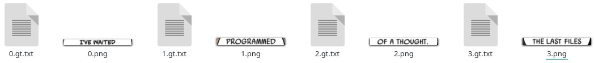

# Seeneva ML scripts

[Русский](docs/README-ru.md)
___

Contains helper scripts to preprocess train data. No dataset is provided.

## Clone

This repository contains submodules.

*Clone it using:*

```console
git clone --recurse-submodules https://github.com/Seeneva/ml-scripts.git
```

*Or init submodules using:*

```console
git submodule init
```

## Setup

Repository contains `./setup.py` and `./requirements.txt` with the list of required Python dependencies.

### Using Python Virtual Environments

```console
python -m venv .venv
source .venv/bin/activate
pip install -r requirements.txt
```

### Using system Python

```console
pip install -r requirements.txt
```

## [YOLOv4-tiny](https://github.com/AlexeyAB/darknet)

This model is used to detect object on comic book pages.

### Supported classes

| Class ID | Name          | Description              |
| -------- | ------------- | ------------------------ |
| 0        | speech_baloon | Single speech balloon    |
| 1        | panel         | Single panel on the page |

### Prepare and train

- Put all your comic book pages dataset into `./yolo/dataset` directory. This directory shouldn't contains any subdirectories.
- Anotate each comic book page in the directory using YOLO format and [supported classes](#supported-classes). You can use tools like [labelImg](https://github.com/tzutalin/labelImg).
- Run `./yolo_width_split.py` script to split 'Double Page Spread' image into few separate images. Original wide images will be moved into `./yolo/data_wide_backup` directory.
- *(Optionally)* Run `./yolo_stats.py` script to calculate dataset details.
- Run `./yolo_train_data.py` script to generate required files to train YOLO model. All files will be placed into `./yolo` directory.
- Create and put YOLO `yolo-obj.cfg` file into `./yolo` directory.
- Train your model using [YOLOv4-tiny darknet](https://github.com/AlexeyAB/darknet#how-to-train-tiny-yolo-to-detect-your-custom-objects).
- *(Optional)* Convert model into TensorFlow Lite format:

```console
git clone -b config https://github.com/Seeneva/tensorflow-yolov4-tflite.git converter

python ./converter/save_model.py --weights ${YOUR_YOLO_BACKUP_PATH}/yolo-obj_final.weights --output ${YOUR_TF_BACKUP_PATH}/tf --score_thres 0.7 --input_size 480x736 --model yolov4 --tiny --framework tflite

python ./converter/convert_tflite.py --weights ${YOUR_TF_BACKUP_PATH}/tf --output ${YOUR_TF_BACKUP_PATH}/tf/seeneva.tflite --input_size 480x736 --quantize_mode float16
```

## [Tesseract](https://github.com/tesseract-ocr/tesseract)

OCR model is used to recognize text inside speech balloons.

### Setup

You should [install](https://tesseract-ocr.github.io/tessdoc/Downloads.html) Tesseract on your system and make sure that your environment can run `make` commands.

### Prepare and train

- Run `./yolo_extract_objects.py --class_id 0` to crop all speech balloons from YOLO dataset and place them into `./yolo/objects/0` directory.
- Now you need to crop each text line in the cropped speech balloons and save them as separete \*.png files in the `./tesseract/${LANG_NAME}_seeneva-ground-truth` directory.
- Create \*.gt.txt file for each text line \*.png file in the `./tesseract/${LANG_NAME}_seeneva-ground-truth`. You can use `./tesseract_cteate_txt.py` to automate it.



- Write out a content of each line \*.png into \*.gt.txt file. Usually all letters should be uppercased. So for image **1.png** (example above) you should write `PROGRAMMED` into **1.gt.txt** file.
- Run `./tesseract_check_data.py` to check that dataset is fine.
- Run `./tesseract_train.sh` to start training.
- *(Optionally)* Convert into fast (int) format using:

```console
combine_tessdata -c ./tesstrain/data/${LANG_NAME}_seeneva.traineddata
```

## License

Copyright © 2021 Sergei Solodovnikov under the [Apache License 2.0](LICENSE).

**Note** that dependencies may have different license. See [LICENSE-3RD-PARTY](docs/3RD-PARTY-LICENSES.md) for more information.
