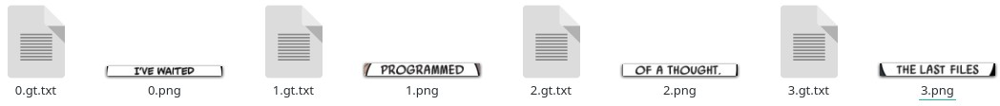

# Seeneva ML scripts

[English](../README.md)
___

Репозиторий содержит набор скриптов для помощи в предварительной обработке тренировочных данных для машинного обучения. Репозиторий не содержит самих данных.

## Клонирование

Репозиторий содержит субмодули.

*Клонирование:*

```console
git clone --recurse-submodules https://github.com/Seeneva/ml-scripts.git
```

*Или инициализация субмодулей:*

```console
git submodule init
```

## Установка

Репозиторий содержит `./setup.py` и `./requirements.txt` со списком Python зависимостей.

### Используя Python Virtual Environments

```console
python -m venv .venv
source .venv/bin/activate
pip install -r requirements.txt
```

### Используя системный Python

```console
pip install -r requirements.txt
```

## [YOLOv4-tiny](https://github.com/AlexeyAB/darknet)

Эта ML модель используется для нахождения объектов на страницах комикса.

### Поддерживаемые классы

| ID класса | Имя           | Описание                   |
| --------- | ------------- | -------------------------- |
| 0         | speech_baloon | Текстовый балун            |
| 1         | panel         | Панель на странице комикса |

### Подготовка и тренировка

- Поместите все ваши данные (изображения страниц комиксов) в `./yolo/dataset` директорию. Эта директория не должна содержать поддиректорий.
- Аннотируйте каждую страницу комикса в этой директории, используя формат YOLO и [поддерживаемые классы](#поддерживаемые-классы). Для этого можно воспользоваться например [labelImg](https://github.com/tzutalin/labelImg).
- Запустите `./yolo_width_split.py` скрипт чтобы разделить изображение 'двустороннего разворота' на отдельные изображения поменьше. Оригинальные изображения будут перемещены в `./yolo/data_wide_backup` директорию.
- *(Необязательно)* Запустите `./yolo_stats.py` скрипт, чтобы подсчитать информацию о вашем наборе данных.
- Запустите `./yolo_train_data.py` скрипт, чтобы сгенерировать необходимые файлы для тренировки YOLO модели. Все файлы будут помещены в `./yolo` директорию.
- Создайте и поместите YOLO `yolo-obj.cfg` файл в `./yolo` директорию.
- Тренируйте модель, используя [YOLOv4-tiny darknet](https://github.com/AlexeyAB/darknet#how-to-train-tiny-yolo-to-detect-your-custom-objects).
- *(Необязательно)* Преобразуйте модель в формат TensorFlow Lite:

```console
git clone -b config https://github.com/Seeneva/tensorflow-yolov4-tflite.git converter

python ./converter/save_model.py --weights ${YOUR_YOLO_BACKUP_PATH}/yolo-obj_final.weights --output ${YOUR_TF_BACKUP_PATH}/tf --score_thres 0.7 --input_size 480x736 --model yolov4 --tiny --framework tflite

python ./converter/convert_tflite.py --weights ${YOUR_TF_BACKUP_PATH}/tf --output ${YOUR_TF_BACKUP_PATH}/tf/seeneva.tflite --input_size 480x736 --quantize_mode float16
```

## [Tesseract](https://github.com/tesseract-ocr/tesseract)

Модель OCR используется для распознавания текста внутри текстовых балунов на страницах комикса.

### Установка

Вам нужно [установить](https://tesseract-ocr.github.io/tessdoc/Downloads.html) Tesseract и убедиться, что ваше окружение готово к запуску `make` команд.

### Подготовка и тренировка

- Запустите `./yolo_extract_objects.py --class_id 0`, чтобы обрезать все текстовые балуны из вашего YOLO набора данных (страниц комиксов) и поместить их изображения в `./yolo/objects/0` директорию.
- Теперь вам нужно обрезать каждую текстовую строку на полученных балунах и сохранить эти строки как отдельные \*.png файлы в `./tesseract/${LANG_NAME}_seeneva-ground-truth` директорию.
- Создайте \*.gt.txt файл для каждого \*.png файла в `./tesseract/${LANG_NAME}_seeneva-ground-truth`. Для автоматизации можно использовать `./tesseract_cteate_txt.py` скрипт.



- Перепишите текстовое содержимое каждого \*.png файла в соответствующий \*.gt.txt файл. Как правило все буквы должны быть заглавными. Так, для картинки **1.png** (пример выше) вы должны записать `PROGRAMMED` в файл **1.gt.txt**.
- Запустите `./tesseract_check_data.py`, чтобы проверить, что с данными всё в порядке.
- Запустите `./tesseract_train.sh` для начала тренировки.
- *(Необязательно)* Преобразуйте модель в формат fast (int):

```console
combine_tessdata -c ./tesstrain/data/${LANG_NAME}_seeneva.traineddata
```

## Лицензия

Copyright © 2021 Sergei Solodovnikov under the [Apache License 2.0](../LICENSE).

**Замечание**. Лицензии зависимостей могут отличаться. Для большей информации посмотрите [LICENSE-3RD-PARTY](3RD-PARTY-LICENSES.md).
